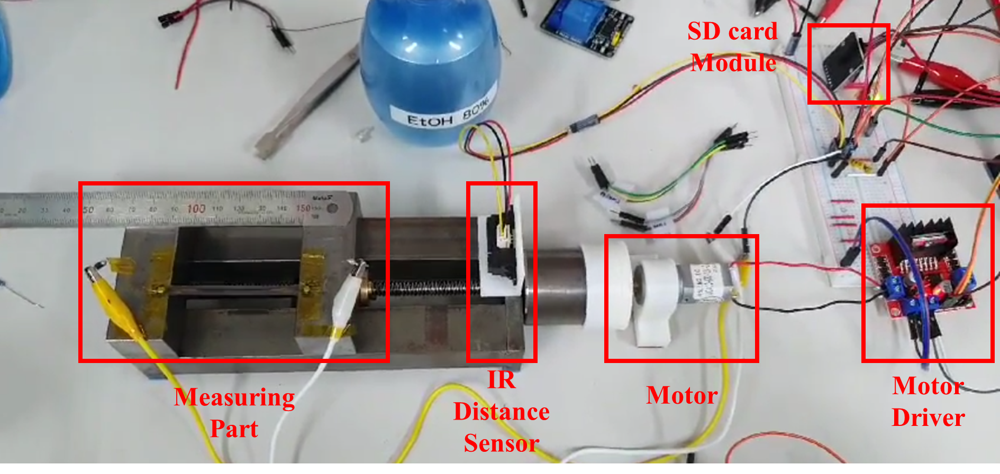
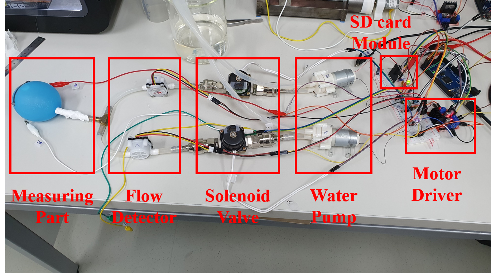

# Measurement Platform

> 학위논문: [Flexible and Stretchable Strain Sensor for Monitoring of Bladder Volume](http://www.riss.kr/search/detail/DetailView.do?p_mat_type=be54d9b8bc7cdb09&control_no=824ad4f8d636f59bffe0bdc3ef48d419&keyword=Flexible%20and%20Stretchable%20Strain%20Sensor%20for%20Monitoring%20of%20Bladder%20Volume)
>
> MEMS2021: [Highly Stretchable Strain Sensor and Detecting System for Monitoring of Bladder Volume](https://ieeexplore.ieee.org/document/9375387)

## Strain-Resistance Measurement

---

## Balloon-Model Test Platform

